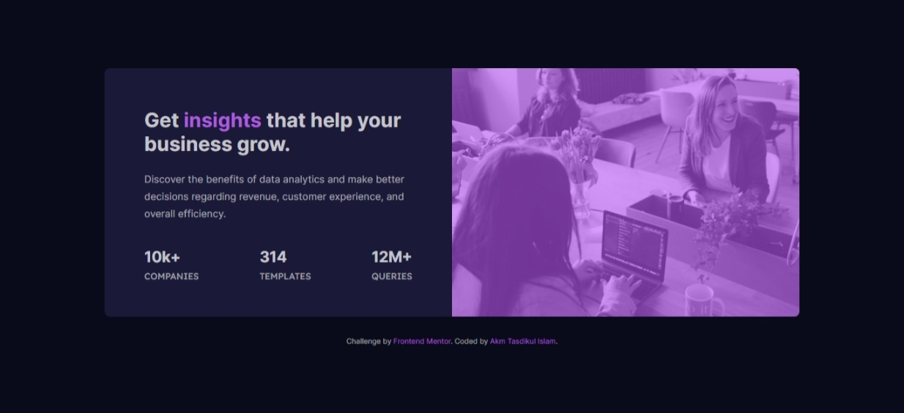
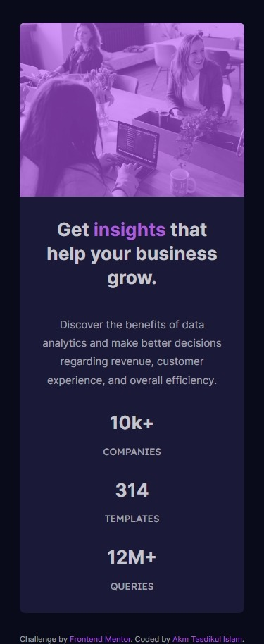

# Frontend Mentor - Stats preview card component solution

This is a solution to the [Stats preview card component challenge on Frontend Mentor](https://www.frontendmentor.io/challenges/stats-preview-card-component-8JqbgoU62). Frontend Mentor challenges help you improve your coding skills by building realistic projects.

## Table of contents

- [Overview](#overview)
  - [The challenge](#the-challenge)
  - [Screenshot](#screenshot)
  - [Links](#links)
- [My process](#my-process)
  - [Built with](#built-with)
  - [What I learned](#what-i-learned)
  - [Continued development](#continued-development)
- [Author](#author)

## Overview

### The challenge

Users should be able to:

- View the optimal layout depending on their device's screen size

### Screenshot

<div 
  style="
    display:flex;
    align-items:flex-end;
    gap:5px; text-align:center;
    width:100%;
    height:auto;
">

<div
  sytle="
    display:flex;
    flex-direction:column;
    width:70%
"> Desktop View</div>
<div
  sytle="
    display:flex;
    flex-direction:column;
    width:30%
"> Mobile View</div>
</div>

### Links

- Solution URL: [Solution URL](https://github.com/akmtasdikulislam/stats-preview-card-component)
- Live Site URL: [Live site URL](https://akmtasdikulislam.github.io/stats-preview-card-component/)

## My process

### Built with

- Semantic HTML5 markup
- CSS custom properties
- Flexbox

### What I learned

I learnt the usage of `::before` psuedo element and `filter` property in css

```css
.card-image::before {
  content: "";
  width: 100%;
  height: 100%;
  background-color: hsl(277, 95%, 66%);
  filter: opacity(0.6);
  z-index: 9;
  position: absolute;
  border-radius: 0 0.5rem 0.5rem 0;
}
```

### Continued development

I've used a `::before` psuedo element for making the `.card-image` look purple. It can also be done using css `filter: hue-rotate()` property. But in my case it's not working. So, I'll ask for solution to this issue and fix this issue as soon as possible

## Author

- Website - [Akm Tasdikul Islam](http://www.tasdikul.rf.gd)
- Frontend Mentor - [@akmtasdikulislam](https://www.frontendmentor.io/profile/akmtasdikulislam)
- Twitter - [@Akm_Tasdikul](https://www.twitter.com/Akm_Tasdikul)
